# ParaView の howto
血管の3Dモデリングと流体解析を進めるうえで、ParaViewで行った可視化やデータ解析の手順のおぼえがき

## 環境
ParaView 5.13.3

## CLI を利用したバッチ処理
単に形状や解析結果の可視化をするだけならGUIを使うのが速いが、データ解析をしたい場合は CLI を利用すると便利。ParaView は pvpython という python 限定 の CLI を提供している。ParaViewをインストールするとセットでインストールされるが、パスは手動で通す必要がある。pvpython.exe は(windowsの場合)以下の場所に入っている。
```
C:/Program Files/ParaView5.13.3/bin/
```
パスを通した後、paraviewライブラリを利用したpythonスクリプトをコマンドラインから実行できるようになる
```
$ pvpython your-method.py
```
GUI上でもEditorを利用でき、下の画像のように "Tool" → "Python Script Editor" → コードを書く → "File" → "Run" で実行できる。
<p align="center">
  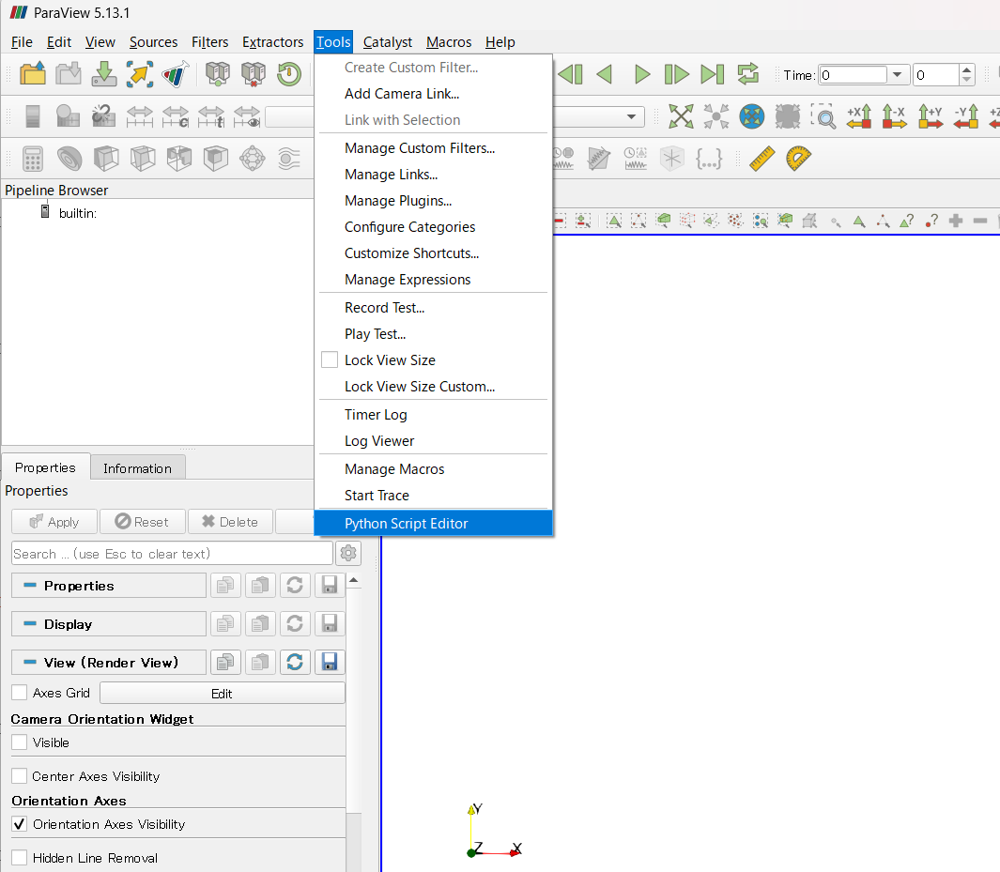
  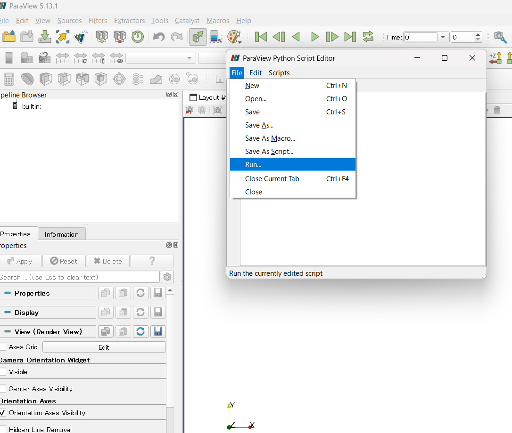
</p>

## 断面の可視化と断面積計算 (GUI)
1. 3次元形状をimportする
2. "slice"フィルタで切断したい位置、角度を調整(下図左)し、"Pipeline Browser"から"slice1"のみ表示してそれ以外はチェックを外す。"slice1"の"properties"を開き、"show plane"のチェックを外し、カメラの"Reset"を押して図形位置を画面中心に合わせる(下図右)。
<p align="center">
  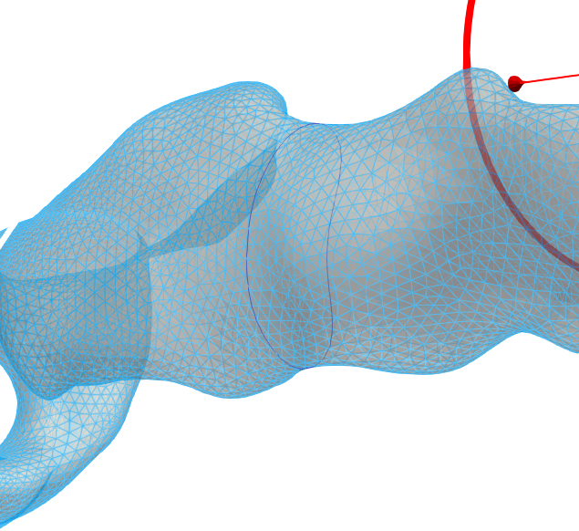
  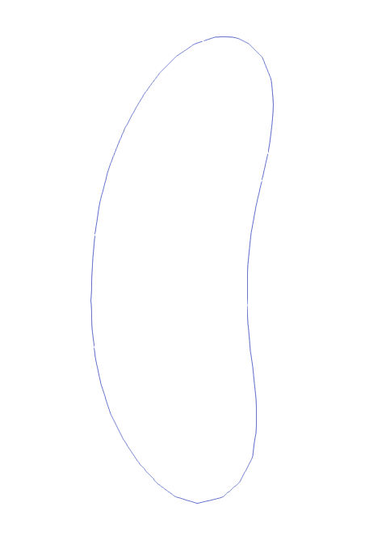
</p>
3. "Filters" → "alphabetical" → "Delauny2D" で三角形メッシュを生成する。上の表示を"surface" → "surface with edges"にする(下図左)。
  "Pipeline Browser"で生成された"Delauny2D1"を選択し、"Filters" → "Alphabetical" → "Cell Size" を押す。
    生成された"CellSize1"を選択し、"Properties" → "Compute Area"のみにチェック入れ、他外す → 表示(上部タブ)の "solid color"を"Area"に → 各三角形パッチの面積が可視化される(下図右)。
<p align="center">
  
  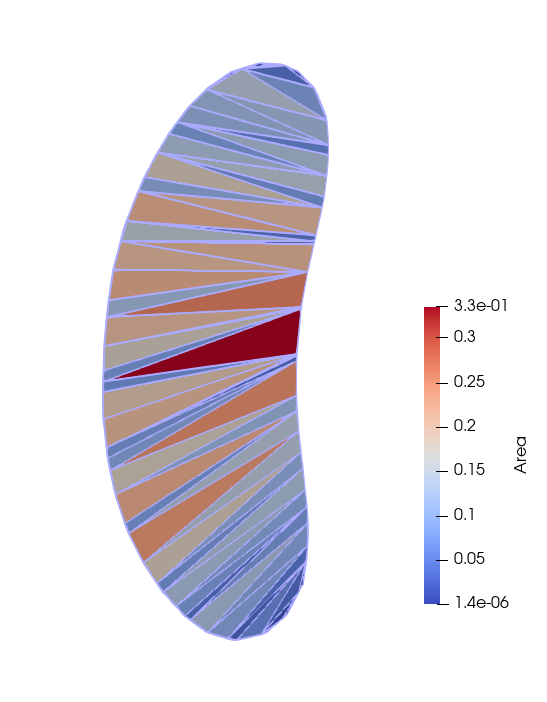
</p>
4. "Filters" → "Alphabetical" → "Integrate Variables" → 開いたspread sheet で "showing" を "IntegrateVariable1", "Attribute" を "Cell Data"  にすると、"Area" のcolumnに総面積が表示される(下図)
<p align="center">
  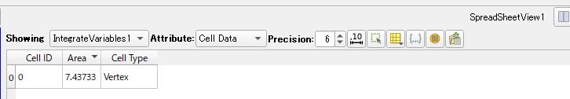
</p>

### ※ 断面形状が凹形の場合 
上記手順 (Delauny2D) は凹型形状に対して、外部にまで三角形を張ってしまうことがある(下図)。 <br>
<p align="center">
  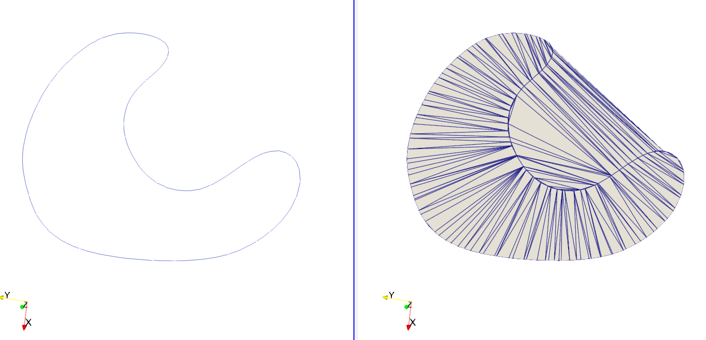
</p>
そこで別の方法として、vtkライブラリを使用し閉曲線内部に三角形メッシュを作る。

+ 上記 1.2.までは同じ
+ "slice1"を選択し、"Filters" → "Alphabetical" → "clean"。
+ "slice1"を選択し、"Filters" → "Programmable" → "Programmable Filter" で、"Properties" にある editorに以下のスクリプトを打ち、"Apply"
  
  ```python
    try:
        import vtk                   # 通常
    except Exception:
        from paraview import vtk     # ParaView のラッパー

    inp = inputs[0].VTKObject

    # 微小ギャップ/重複点を掃除
    clean = vtk.vtkCleanPolyData()
    clean.SetInputData(inp)
    clean.SetTolerance(1e-6)         # 必要に応じて調整
    clean.Update()

    # 線分を連結して閉ループを作る
    strip = vtk.vtkStripper()
    strip.SetInputConnection(clean.GetOutputPort())
    strip.JoinContiguousSegmentsOn()
    strip.Update()

    # 閉曲線（外周＋内周）から“内部だけ”を三角化
    tri = vtk.vtkContourTriangulator()
    tri.SetInputConnection(strip.GetOutputPort())
    tri.Update()

    # 出力
    output.ShallowCopy(tri.GetOutput())
  ```
+ これで閉曲線内部にのみ三角形メッシュが生成されるので、以降は上記手順と同じく、"cell size" → "Integrate Variables" で正しく面積が計算できる。
<p align="center">
  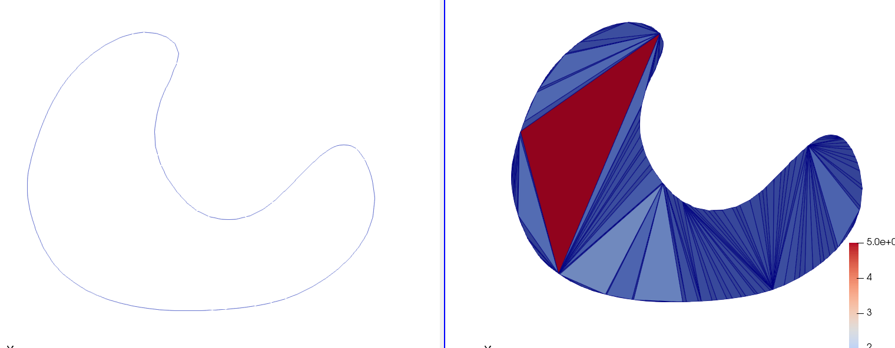
</p>

## 断面の可視化と断面積計算 (CLI)
GUI操作は直感的だが、切断面の決め方が決定的ではないし(一応、GUI上でもslice面の位置、角度共に数値で指定はできる)、大量処理には向かない。例えば血管の中心線に沿って一定の間隔で垂直断面をとって、全体的な断面形状を知りたいときはCLIを用いる。

## GUI上で切断面を決め、中心線を使いCLIで位置指定し垂直断面を切る
<p align="center">
  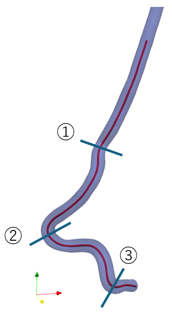
  
  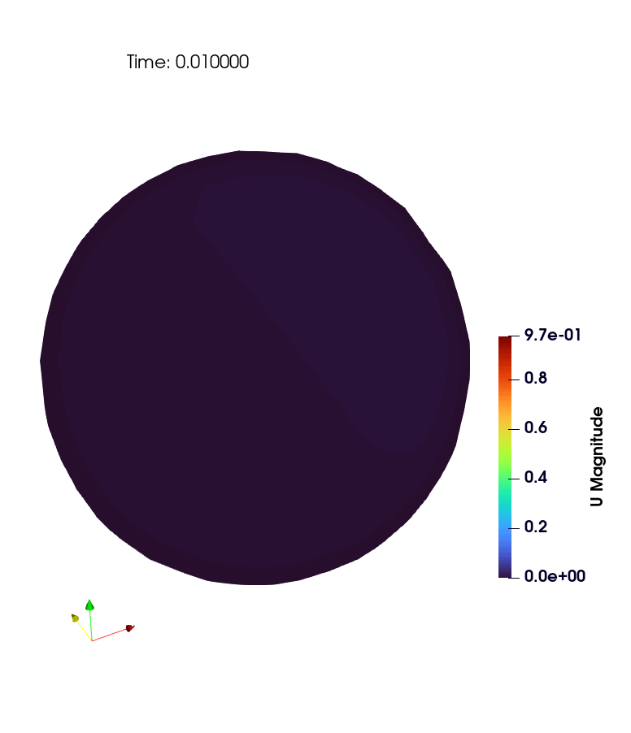
  
</p>
↑ 大腿動脈において、拍動流を想定してpimpleFoamで数値解析を行い、断面流速分布を可視化したもの。<br>
<br>

<p align="center">
  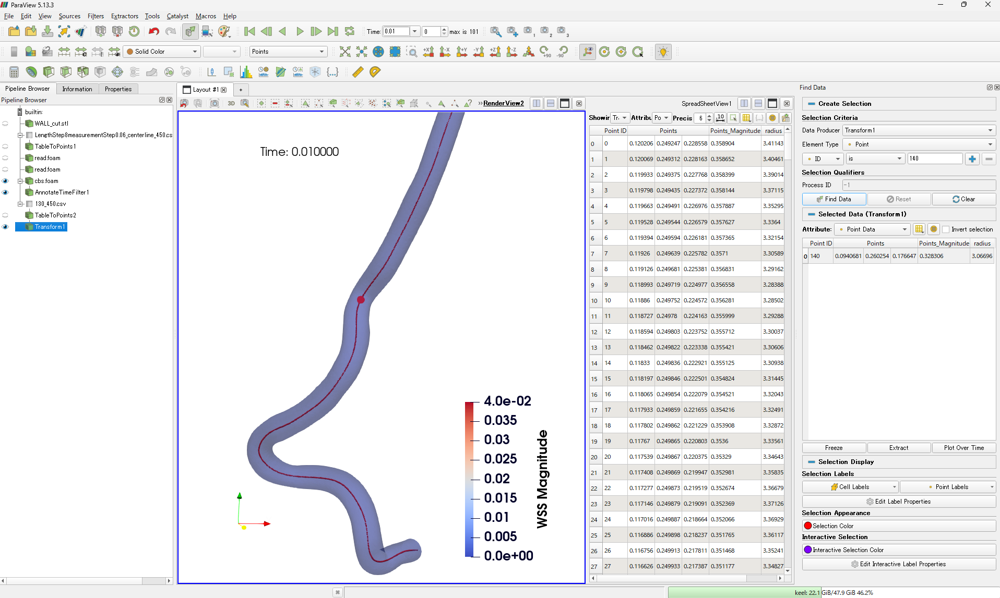
</p>

+ ParaViewで形状(あるいは流体解析結果)と中心線をimportし、形状の透明度("Opacity")を下げつつ中心線点群も合わせて可視化。
+ "Pipeline Brawser"で可視化している中心線を選択し"Find data" → 適当にIDを打ちながら、切断したい位置の中心線点番号を確認する
+ 切る場所を決めたら、"Tools" → "python script editor" に以下を張り付けて "Run"
+ 指定した中心線の点{origin}で、隣接点から法線ベクトル{normal}を計算し、slice面が作成される

  ```python
    # 中心線点群のIDを指定し、その点において中心線に対する垂直な断面を切って可視化するpvpythonコード。
    from paraview.simple import *
    from paraview import servermanager
    import math

    # ---- SETTINGS (edit here) ----
    CENTERLINE_NAME = "Transform1"   # !ここを変える!: TableToPoints の後に Transform しているならその名前
    GEOM_NAME       = "cbs.foam"     # !ここを変える!: 解析ジオメトリ（表面/ボリューム）のソース名
    POINT_ID        = 300            # !ここを変える!: 切断したい位置の中心線点番号

    # ---- fetch sources ----
    cl_src = FindSource(CENTERLINE_NAME)
    if cl_src is None:
        raise RuntimeError(f"Centerline source '{CENTERLINE_NAME}' not found.")
    geom_src = FindSource(GEOM_NAME)
    if geom_src is None:
        raise RuntimeError(f"Geometry source '{GEOM_NAME}' not found.")

    # Centerline points (client-side)
    cl_vtk = servermanager.Fetch(cl_src)  # vtkDataSet
    npts = cl_vtk.GetNumberOfPoints()
    if npts < 3:
        raise RuntimeError("Centerline needs at least 3 points for central difference.")

    # clamp the point id in [0, npts-1]
    pid = max(0, min(POINT_ID, npts-1))

    # get neighbors for central difference
    pid_minus = max(0, pid-1)
    pid_plus  = min(npts-1, pid+1)

    p0 = cl_vtk.GetPoint(pid)
    pm = cl_vtk.GetPoint(pid_minus)
    pp = cl_vtk.GetPoint(pid_plus)

    # central difference tangent (pp - pm); this will be the slice plane NORMAL
    tx = pp[0] - pm[0]
    ty = pp[1] - pm[1]
    tz = pp[2] - pm[2]
    norm_len = math.sqrt(tx*tx + ty*ty + tz*tz)
    if norm_len == 0.0:
        raise RuntimeError("Zero-length tangent; check centerline ordering or duplicate points.")
    nx, ny, nz = tx/norm_len, ty/norm_len, tz/norm_len

    print(f"Using POINT_ID={pid}")
    print(f"Origin  = ({p0[0]:.6f}, {p0[1]:.6f}, {p0[2]:.6f})")
    print(f"Normal  = ({nx:.6f}, {ny:.6f}, {nz:.6f})")

    # ---- create/update Slice ----
    slice_name = f"Slice_at_ID_{pid}"
    existing = FindSource(slice_name)

    if existing is None:
        slc = Slice(registrationName=slice_name, Input=geom_src)
    else:
        slc = existing
        slc.Input = geom_src

    # ParaView の Slice は "SliceType" に Plane を持ち、その Origin/Normal を設定
    slc.SliceType = "Plane"
    slc.SliceType.Origin = [p0[0], p0[1], p0[2]]
    slc.SliceType.Normal = [nx, ny, nz]

    Show(slc)
    Render()
  ```

## 中心線に対して垂直に切った断面において、軸方向速度成分をカラーマップで、断面に沿う方向の流速をベクトルで表現

<p align="center">
  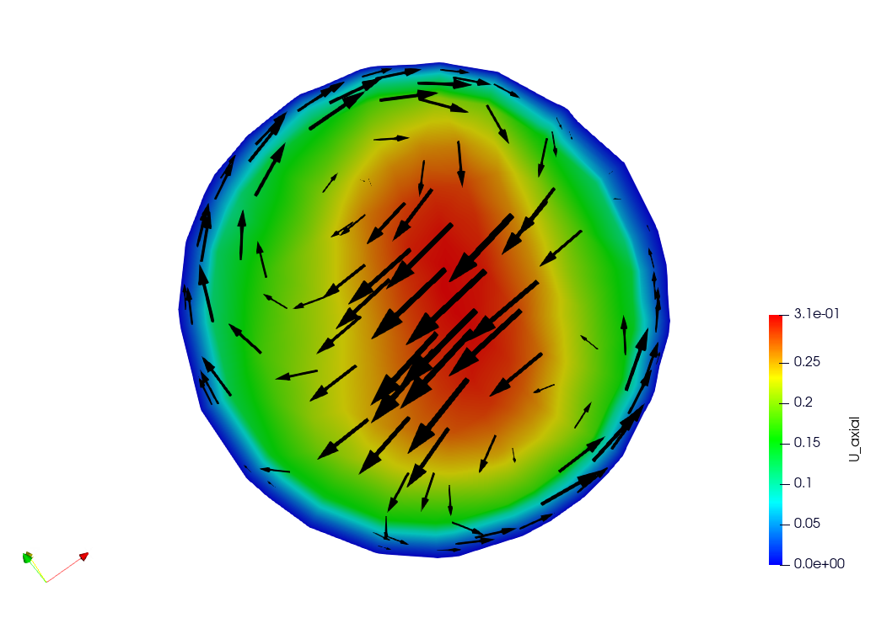
</p>

断面の流速分布を可視化するためのよくある方法は、画像のように、断面に垂直な方向(管軸方向)の速度成分をカラーマップで表現し、断面に沿う方向の速度成分を矢印で表現する方法である。<br>
以下の点に注意する。

+ 断面に垂直な方向の速度成分(カラーマップ)は絶対値ではなく符号ありで表現する(逆流していれば負の値をとる)
+ 断面の向き(上下左右)が分かるようにする (0°, 90°などを3次元形状及び断面上に表示する)。後述。(上画像及び下記スクリプトはまだそれができていない)
+ (よく論文で使われている色合いを参考に、ParaView で カラーマップは color map editor の presets で "All" → "Blue To Red Rainbow", 矢印は黒にしている。)
+ 下記のスクリプトは、simpleFoam 等の解析で流れ場が定常に至った後のOpenFOAM出力を前提にしており、pimpleFoam等の非定常解析にはまだ対応していない。

<br>

手順は上記の垂直断面を切る場合と同じで、

+ ParaViewで流体解析結果(read.foam)と中心線をimportし、形状の透明度("Opacity")を下げつつ中心線点群も合わせて可視化。
+ "Pipeline Brawser"で可視化している中心線を選択し"Find data" → 適当にIDを打ちながら、切断したい位置の中心線点番号を確認する
+ 切る場所を決めたら、"Tools" → "Python Script Editor" に以下を張り付けて "Run"

``` python
# 中心線点群のIDを指定し、その点において中心線に対する垂直な断面を切り、中心線方向の速度成分をカラーマップで表現し、断面に沿う方向の速度成分を矢印で表現するpvpythonコード。
# 中心線方向の速度成分は、中心線番号が大きくなる方向が正になる。(中心線.csvが、INLET → OULET の方向順で記述されていることを想定している)
from paraview.simple import *
from paraview import servermanager
import math

# ---- SETTINGS (edit here) ----
CENTERLINE_NAME = "Transform1"   # Centerline のソース名（TableToPoints→Transform後など）
GEOM_NAME       = "read.foam"    # OpenFOAM（または他）結果のソース名
POINT_ID        = 280            # 切断位置の中心線 点番号
# グリフ（ベクトル）の見やすさ調整
GLYPH_STRIDE    = 5              # 矢印表示の間引き
GLYPH_SCALE     = 0.01           # 矢印のスケール
SAVE_SCREENSHOT = False          # 画像保存したい場合 True
OUTFILE         = "slice_axial_inplane.png"

# ==============================
# ---- fetch sources ----
cl_src = FindSource(CENTERLINE_NAME)
if cl_src is None:
    raise RuntimeError(f"Centerline source '{CENTERLINE_NAME}' not found.")
geom_src = FindSource(GEOM_NAME)
if geom_src is None:
    raise RuntimeError(f"Geometry source '{GEOM_NAME}' not found.")

# Centerline points (client-side)
cl_vtk = servermanager.Fetch(cl_src)  # vtkDataSet
npts = cl_vtk.GetNumberOfPoints()
if npts < 3:
    raise RuntimeError("Centerline needs at least 3 points for central difference.")

# clamp the point id in [0, npts-1]
pid = max(0, min(POINT_ID, npts-1))

# get neighbors for central difference
pid_minus = max(0, pid-1)
pid_plus  = min(npts-1, pid+1)

p0 = cl_vtk.GetPoint(pid)
pm = cl_vtk.GetPoint(pid_minus)
pp = cl_vtk.GetPoint(pid_plus)

# central difference tangent (pp - pm); we use it as slice plane NORMAL
tx = pp[0] - pm[0]
ty = pp[1] - pm[1]
tz = pp[2] - pm[2]
norm_len = math.sqrt(tx*tx + ty*ty + tz*tz)
if norm_len == 0.0:
    raise RuntimeError("Zero-length tangent; check centerline ordering or duplicate points.")

nx, ny, nz = tx/norm_len, ty/norm_len, tz/norm_len

print(f"Using POINT_ID={pid}")
print(f"Origin  = ({p0[0]:.6f}, {p0[1]:.6f}, {p0[2]:.6f})")
print(f"Normal  = ({nx:.6f}, {ny:.6f}, {nz:.6f})")

# ---- create/update Slice ----
slice_name = f"Slice_at_ID_{pid}"
existing = FindSource(slice_name)

if existing is None:
    slc = Slice(registrationName=slice_name, Input=geom_src)
else:
    slc = existing
    slc.Input = geom_src

# ParaView の Slice は "SliceType" に Plane を持ち、その Origin/Normal を設定
slc.SliceType = "Plane"
slc.SliceType.Origin = [p0[0], p0[1], p0[2]]
slc.SliceType.Normal = [nx, ny, nz]

# ---- Axial scalar (U·n) と In-plane vector (U - (U·n)n) を作る ----
# 1) Calculator: U_axial = (U · n)  (符号付き)
calc_ax = Calculator(registrationName=f"Calc_Uax_{pid}", Input=slc)
calc_ax.ResultArrayName = "U_axial"
calc_ax.Function = f"(U_X*{nx} + U_Y*{ny} + U_Z*{nz})"

# 2) Calculator: U_inplane = U - (U·n) n
calc_ip = Calculator(registrationName=f"Calc_Uin_{pid}", Input=calc_ax)
calc_ip.ResultArrayName = "U_inplane"
calc_ip.Function = (
    f"(U_X-((U_X*{nx}+U_Y*{ny}+U_Z*{nz})*{nx}))*iHat + "
    f"(U_Y-((U_X*{nx}+U_Y*{ny}+U_Z*{nz})*{ny}))*jHat + "
    f"(U_Z-((U_X*{nx}+U_Y*{ny}+U_Z*{nz})*{nz}))*kHat"
)

# ---- 表示設定 ----
view = GetActiveViewOrCreate('RenderView')

# 断面（カラーマップ＝U_axial）
disp_slice = Show(calc_ip, view)
ColorBy(disp_slice, ('POINT_DATA', 'U_axial'))     # 軸方向速度（符号付き）で着色
disp_slice.SetScalarBarVisibility(view, True)
disp_slice.Opacity = 0.98

# # カラーバーのタイトル・単位（任意）
# lut = GetColorTransferFunction('U_axial')
# bar = GetScalarBar(lut, view)
# bar.Title = 'Axial velocity (m/s)'

# グリフ（面内ベクトルを黒の Solid Color で）
glyph = Glyph(registrationName=f"Glyph_inplane_{pid}", Input=calc_ip, GlyphType='Arrow')
glyph.OrientationArray = ['POINT_DATA', 'U_inplane']   # 方向 = 面内ベクトル
glyph.ScaleArray       = ['POINT_DATA', 'U_inplane']   # スケール = 面内ベクトルの大きさ
glyph.GlyphMode        = 'Every Nth Point'
glyph.Stride           = GLYPH_STRIDE
glyph.ScaleFactor      = GLYPH_SCALE

gdisp = Show(glyph, view)
ColorBy(gdisp, None)                           
gdisp.SetScalarBarVisibility(view, False)      
gdisp.AmbientColor = [0.0, 0.0, 0.0]
gdisp.DiffuseColor = [0.0, 0.0, 0.0]
gdisp.Specular = 0.0

Hide(geom_src, view)  # 背景に元メッシュが出ていれば隠す（任意）

view.Update()
Render()

if SAVE_SCREENSHOT:
    SaveScreenshot(OUTFILE, view, TransparentBackground=False, CompressionLevel='5')
    print(f"Saved screenshot: {OUTFILE}")
```
