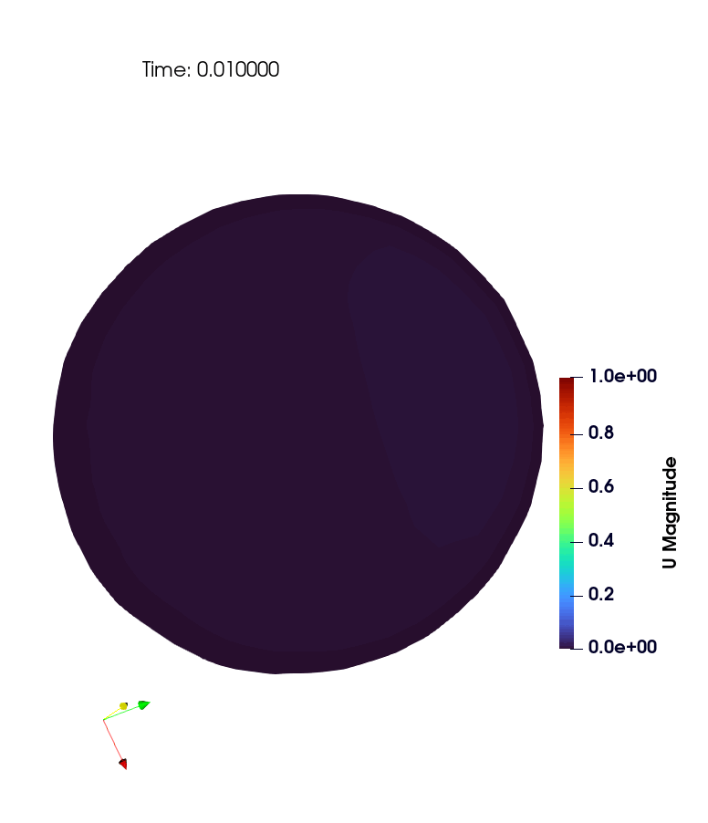

# ParaView の howto
血管の3Dモデリングと流体解析を進めるうえで、ParaViewで行った可視化やデータ解析の手順のおぼえがき

## 環境
ParaView 5.13.3

## CLI を利用したバッチ処理
単に形状や解析結果の可視化をするだけならGUIを使うのが速いが、データ解析をしたい場合は CLI を利用すると便利。ParaView は pvpython という python 限定 の CLI を提供している。ParaViewをインストールするとセットでインストールされるが、パスは手動で通す必要がある。pvpython.exe は(windowsの場合)以下の場所に入っている。
```
C:/Program Files/ParaView5.13.3/bin/
```
パスを通した後、paraviewライブラリを利用したpythonスクリプトをコマンドラインから実行できるようになる
```
$ pvpython your-method.py
```
GUI上でもEditorを利用でき、下の画像のように "Tool" → "Python Script Editor" → コードを書く → "File" → "Run" で実行できる。
<p align="center">
  
  
</p>

## OpenFOAMでの解析結果を、データ形式を変えて保存する (GUI)
<p align="center">
  
  
  
</p>
OpenFOAMで流体解析を行った後、`*.foam` を ParaView にインポートすると、"properties" の中に画像左のような欄があり、デフォルトではすべてのセル及びセルが持つ値が可視化できるようになっている。このうち、自分が必要な情報だけ、データ構造( point data / cell data )やファイル形式(*.csv, *.vtk, *.msh, etc)を指定して保存することができる。自分が保存したい情報だけにチェックを入れて、"File" → "Save Data" で "Files of type" で保存したいデータ形式を選択し、画像右のような保存設定のポップアップ(値の有効数字や、点群データにするかセルデータにするか、など)が出るのでお好みで変更してから保存する。<br>
例えば、WSS(壁面せん断応力) のみを点群データとして保存したい場合、画像中央のように "WALL" patch のみ選択し、そのセルが持つ値のうち　"WSS" のみにチェックを入れて出力する。このように保存したデータを再度可視化したものが右下の画像。 


## GUI上で点やセルを指定し、座標や場の値を確認する
<p align="center">
  
  
</p>

場の値を持つ形状データ (ファイル形式はなんでもよく、例えば *.csv や *.vtk など) をインポートし可視化した後、画像左のように "Hover points on" や "Hover cells on" をクリックし、座標や値が知りたい点(セル) にカーソルを合わせると、画像右のように値が表示される。

## STLファイルのメッシュ妥当性の確認
+ 検証したいSTLファイルを import する
+ "Filters" → "Alphabetical" → "Generates surface normal"

## 断面の可視化と断面積計算 (GUI)
1. 3次元形状をimportする
2. "slice"フィルタで切断したい位置、角度を調整(下図左)し、"Pipeline Browser"から"slice1"のみ表示してそれ以外はチェックを外す。"slice1"の"properties"を開き、"show plane"のチェックを外し、カメラの"Reset"を押して図形位置を画面中心に合わせる(下図右)。
<p align="center">
  
  
</p>
3. "Filters" → "alphabetical" → "Delauny2D" で三角形メッシュを生成する。上の表示を"surface" → "surface with edges"にする(下図左)。
  "Pipeline Browser"で生成された"Delauny2D1"を選択し、"Filters" → "Alphabetical" → "Cell Size" を押す。
    生成された"CellSize1"を選択し、"Properties" → "Compute Area"のみにチェック入れ、他外す → 表示(上部タブ)の "solid color"を"Area"に → 各三角形パッチの面積が可視化される(下図右)。
<p align="center">
  
  
</p>
4. "Filters" → "Alphabetical" → "Integrate Variables" → 開いたspread sheet で "showing" を "IntegrateVariable1", "Attribute" を "Cell Data"  にすると、"Area" のcolumnに総面積が表示される(下図)
<p align="center">
  
</p>

### ※ 断面形状が凹形の場合 
上記手順 (Delauny2D) は凹型形状に対して、外部にまで三角形を張ってしまうことがある(下図)。 <br>
<p align="center">
  
</p>
そこで別の方法として、vtkライブラリを使用し閉曲線内部に三角形メッシュを作る。

+ 上記 1.2.までは同じ
+ "slice1"を選択し、"Filters" → "Alphabetical" → "clean"。
+ "slice1"を選択し、"Filters" → "Programmable" → "Programmable Filter" で、"Properties" にある editorに以下のスクリプトを打ち、"Apply"
  
  ```python
    try:
        import vtk                   # 通常
    except Exception:
        from paraview import vtk     # ParaView のラッパー

    inp = inputs[0].VTKObject

    # 微小ギャップ/重複点を掃除
    clean = vtk.vtkCleanPolyData()
    clean.SetInputData(inp)
    clean.SetTolerance(1e-6)         # 必要に応じて調整
    clean.Update()

    # 線分を連結して閉ループを作る
    strip = vtk.vtkStripper()
    strip.SetInputConnection(clean.GetOutputPort())
    strip.JoinContiguousSegmentsOn()
    strip.Update()

    # 閉曲線（外周＋内周）から“内部だけ”を三角化
    tri = vtk.vtkContourTriangulator()
    tri.SetInputConnection(strip.GetOutputPort())
    tri.Update()

    # 出力
    output.ShallowCopy(tri.GetOutput())
  ```
+ これで閉曲線内部にのみ三角形メッシュが生成されるので、以降は上記手順と同じく、"cell size" → "Integrate Variables" で正しく面積が計算できる。
<p align="center">
  
</p>

## 断面の可視化と断面積計算 (CLI)
GUI操作は直感的だが、切断面の決め方が決定的ではないし(一応、GUI上でもslice面の位置、角度共に数値で指定はできる)、大量処理には向かない。例えば血管の中心線に沿って一定の間隔で垂直断面をとって、全体的な断面形状を知りたいときはCLIを用いる。

## GUI上で切断面を決め、中心線を使いCLIで位置指定し垂直断面を切る
<p align="center">
  
  
  
  
</p>
↑ 大腿動脈において、拍動流を想定してpimpleFoamで数値解析を行い、断面流速分布を可視化したもの。<br>
<br>

<p align="center">
  
</p>

+ ParaViewで形状(あるいは流体解析結果)と中心線をimportし、形状の透明度("Opacity")を下げつつ中心線点群も合わせて可視化。
+ "Pipeline Brawser"で可視化している中心線を選択し"Find data" → 適当にIDを打ちながら、切断したい位置の中心線点番号を確認する
+ 切る場所を決めたら、"Tools" → "python script editor" に以下を張り付けて "Run"
+ 指定した中心線の点{origin}で、隣接点から法線ベクトル{normal}を計算し、slice面が作成される

  ```python
    # 中心線点群のIDを指定し、その点において中心線に対する垂直な断面を切って可視化するpvpythonコード。
    from paraview.simple import *
    from paraview import servermanager
    import math

    # ---- SETTINGS (edit here) ----
    CENTERLINE_NAME = "Transform1"   # !ここを変える!: TableToPoints の後に Transform しているならその名前
    GEOM_NAME       = "cbs.foam"     # !ここを変える!: 解析ジオメトリ（表面/ボリューム）のソース名
    POINT_ID        = 300            # !ここを変える!: 切断したい位置の中心線点番号

    # ---- fetch sources ----
    cl_src = FindSource(CENTERLINE_NAME)
    if cl_src is None:
        raise RuntimeError(f"Centerline source '{CENTERLINE_NAME}' not found.")
    geom_src = FindSource(GEOM_NAME)
    if geom_src is None:
        raise RuntimeError(f"Geometry source '{GEOM_NAME}' not found.")

    # Centerline points (client-side)
    cl_vtk = servermanager.Fetch(cl_src)  # vtkDataSet
    npts = cl_vtk.GetNumberOfPoints()
    if npts < 3:
        raise RuntimeError("Centerline needs at least 3 points for central difference.")

    # clamp the point id in [0, npts-1]
    pid = max(0, min(POINT_ID, npts-1))

    # get neighbors for central difference
    pid_minus = max(0, pid-1)
    pid_plus  = min(npts-1, pid+1)

    p0 = cl_vtk.GetPoint(pid)
    pm = cl_vtk.GetPoint(pid_minus)
    pp = cl_vtk.GetPoint(pid_plus)

    # central difference tangent (pp - pm); this will be the slice plane NORMAL
    tx = pp[0] - pm[0]
    ty = pp[1] - pm[1]
    tz = pp[2] - pm[2]
    norm_len = math.sqrt(tx*tx + ty*ty + tz*tz)
    if norm_len == 0.0:
        raise RuntimeError("Zero-length tangent; check centerline ordering or duplicate points.")
    nx, ny, nz = tx/norm_len, ty/norm_len, tz/norm_len

    print(f"Using POINT_ID={pid}")
    print(f"Origin  = ({p0[0]:.6f}, {p0[1]:.6f}, {p0[2]:.6f})")
    print(f"Normal  = ({nx:.6f}, {ny:.6f}, {nz:.6f})")

    # ---- create/update Slice ----
    slice_name = f"Slice_at_ID_{pid}"
    existing = FindSource(slice_name)

    if existing is None:
        slc = Slice(registrationName=slice_name, Input=geom_src)
    else:
        slc = existing
        slc.Input = geom_src

    # ParaView の Slice は "SliceType" に Plane を持ち、その Origin/Normal を設定
    slc.SliceType = "Plane"
    slc.SliceType.Origin = [p0[0], p0[1], p0[2]]
    slc.SliceType.Normal = [nx, ny, nz]

    Show(slc)
    Render()
  ```

## 断面流速の可視化 (定常流)

<p align="center">
  
</p>

断面の流速分布を可視化するためのよくある方法は、画像のように、断面に垂直な方向(管軸方向)の速度成分をカラーマップで表現し、断面に沿う方向の速度成分を矢印 (向き+長さ) で表現する方法である。以下の点に注意する。

+ 断面に垂直な方向の速度成分(カラーマップ)は絶対値ではなく符号ありで表現する(逆流していれば負の値をとる)
+ 断面の向き(上下左右)が分かるようにする(makeSurfaceLine.py)。
+ (よく論文で使われている色合いを参考に、ParaView で カラーマップは color map editor の presets で "All" → "Blue To Red Rainbow", 矢印は黒にしている。)
+ 下記のスクリプトは、simpleFoam 等の解析で流れ場が定常に至った後のOpenFOAM出力を前提にしており、pimpleFoam等の非定常解析には対応していない

<br>

手順は上記の垂直断面を切る場合と同じで、

+ ParaViewで流体解析結果(read.foam)と中心線をimportし、形状の透明度("Opacity")を下げつつ中心線点群も合わせて可視化。
+ "Pipeline Brawser"で可視化している中心線を選択し"Find data" → 適当にIDを打ちながら、切断したい位置の中心線点番号を確認する
+ 切る場所を決めたら、"Tools" → "Python Script Editor" に以下を張り付けて "Run"

``` python
# 中心線点群のIDを指定し、その点において中心線に対する垂直な断面を切り、中心線方向の速度成分をカラーマップで表現し、断面に沿う方向の速度成分を矢印で表現するpvpythonコード。
# 中心線方向の速度成分は、中心線番号が大きくなる方向が正になる。(中心線.csvが、INLET → OULET の方向順で記述されていることを想定している)
# Slice平面が複数箇所で交わる場合でも、中心線点に最も近い断面のみを可視化する

from paraview.simple import *
from paraview import servermanager
import math

# ---- SETTINGS (ここを変更する) ----
CENTERLINE_NAME = "Transform1"   # Centerline のソース名（TableToPoints→Transform後など）
GEOM_NAME       = "read.foam"    # OpenFOAM（または他）結果のソース名
POINT_ID        = 280            # 切断位置の中心線 点番号

# グリフ（ベクトル）の見やすさ調整
GLYPH_STRIDE    = 5              # 矢印表示の間引き
GLYPH_SCALE     = 0.01           # 矢印のスケール

SAVE_SCREENSHOT = False          # 画像保存したい場合 True
OUTFILE         = "slice_axial_inplane.png"

# ==============================
# ---- fetch sources ----
cl_src = FindSource(CENTERLINE_NAME)
if cl_src is None:
    raise RuntimeError(f"Centerline source '{CENTERLINE_NAME}' not found.")
geom_src = FindSource(GEOM_NAME)
if geom_src is None:
    raise RuntimeError(f"Geometry source '{GEOM_NAME}' not found.")

# Centerline points (client-side)
cl_vtk = servermanager.Fetch(cl_src)  # vtkDataSet
npts = cl_vtk.GetNumberOfPoints()
if npts < 3:
    raise RuntimeError("Centerline needs at least 3 points for central difference.")

# clamp the point id in [0, npts-1]
pid = max(0, min(POINT_ID, npts-1))

# get neighbors for central difference
pid_minus = max(0, pid-1)
pid_plus  = min(npts-1, pid+1)

p0 = cl_vtk.GetPoint(pid)
pm = cl_vtk.GetPoint(pid_minus)
pp = cl_vtk.GetPoint(pid_plus)

# central difference tangent (pp - pm); we use it as slice plane NORMAL
tx = pp[0] - pm[0]
ty = pp[1] - pm[1]
tz = pp[2] - pm[2]
norm_len = math.sqrt(tx*tx + ty*ty + tz*tz)
if norm_len == 0.0:
    raise RuntimeError("Zero-length tangent; check centerline ordering or duplicate points.")

nx, ny, nz = tx/norm_len, ty/norm_len, tz/norm_len

print(f"Using POINT_ID={pid}")
print(f"Origin  = ({p0[0]:.6f}, {p0[1]:.6f}, {p0[2]:.6f})")
print(f"Normal  = ({nx:.6f}, {ny:.6f}, {nz:.6f})")

# ---- create/update Slice ----
slice_name = f"Slice_at_ID_{pid}"
existing = FindSource(slice_name)

if existing is None:
    slc = Slice(registrationName=slice_name, Input=geom_src)
else:
    slc = existing
    slc.Input = geom_src

# ParaView の Slice は "SliceType" に Plane を持ち、その Origin/Normal を設定
slc.SliceType = "Plane"
slc.SliceType.Origin = [p0[0], p0[1], p0[2]]
slc.SliceType.Normal = [nx, ny, nz]

# === 断面のうち中心線点p0に最も近い連結成分だけを抽出 ===
conn_name = f"Conn_at_ID_{pid}"
conn = FindSource(conn_name)
if conn is None:
    conn = Connectivity(registrationName=conn_name, Input=slc)
else:
    conn.Input = slc

# ParaView のバージョン差を吸収して「Closest Point Region」を使う
# 新しめの版では ExtractionMode='Closest Point Region' と ClosestPoint 指定
# 旧版では 'Extract Closest Point Region' または SeedType='Point Seed'
ok = False
for mode in ('Closest Point Region', 'Extract Closest Point Region'):
    try:
        conn.ExtractionMode = mode
        conn.ClosestPoint = [p0[0], p0[1], p0[2]]
        ok = True
        break
    except Exception:
        pass
if not ok:
    try:
        conn.ExtractionMode = 'Extract Regions'
        conn.SeedType = 'Point Seed'
        conn.SeedType.Point1 = [p0[0], p0[1], p0[2]]
        ok = True
    except Exception:
        pass
if not ok:
    raise RuntimeError("Connectivity filter does not support 'closest point' in this ParaView version.")

# ---- Axial scalar (U·n) と In-plane vector (U - (U·n)n) を作る ----
# 1) Calculator: U_axial = (U · n)  (符号付き)
calc_ax = Calculator(registrationName=f"Calc_Uax_{pid}", Input=conn)
calc_ax.ResultArrayName = "U_axial"
calc_ax.Function = f"(U_X*{nx} + U_Y*{ny} + U_Z*{nz})"

# 2) Calculator: U_inplane = U - (U·n) n
calc_ip = Calculator(registrationName=f"Calc_Uin_{pid}", Input=calc_ax)
calc_ip.ResultArrayName = "U_inplane"
calc_ip.Function = (
    f"(U_X-((U_X*{nx}+U_Y*{ny}+U_Z*{nz})*{nx}))*iHat + "
    f"(U_Y-((U_X*{nx}+U_Y*{ny}+U_Z*{nz})*{ny}))*jHat + "
    f"(U_Z-((U_X*{nx}+U_Y*{ny}+U_Z*{nz})*{nz}))*kHat"
)

# ---- 表示設定 ----
view = GetActiveViewOrCreate('RenderView')

# 断面（カラーマップ＝U_axial）
disp_slice = Show(calc_ip, view)
ColorBy(disp_slice, ('POINT_DATA', 'U_axial'))     # 軸方向速度（符号付き）で着色
disp_slice.SetScalarBarVisibility(view, True)
disp_slice.Opacity = 0.98

# # カラーバーのタイトル・単位（任意）
# lut = GetColorTransferFunction('U_axial')
# bar = GetScalarBar(lut, view)
# bar.Title = 'Axial velocity (m/s)'

# グリフ（面内ベクトルを黒の Solid Color で）
glyph = Glyph(registrationName=f"Glyph_inplane_{pid}", Input=calc_ip, GlyphType='Arrow')
glyph.OrientationArray = ['POINT_DATA', 'U_inplane']   # 方向 = 面内ベクトル
glyph.ScaleArray       = ['POINT_DATA', 'U_inplane']   # スケール = 面内ベクトルの大きさ
glyph.GlyphMode        = 'Every Nth Point'
glyph.Stride           = GLYPH_STRIDE
glyph.ScaleFactor      = GLYPH_SCALE

gdisp = Show(glyph, view)
ColorBy(gdisp, None)
gdisp.SetScalarBarVisibility(view, False)
gdisp.AmbientColor = [0.0, 0.0, 0.0]
gdisp.DiffuseColor = [0.0, 0.0, 0.0]
gdisp.Specular = 0.0

Hide(geom_src, view)  # 背景に元メッシュが出ていれば隠す（任意）

view.Update()
Render()

if SAVE_SCREENSHOT:
    SaveScreenshot(OUTFILE, view, TransparentBackground=False, CompressionLevel='5')
    print(f"Saved screenshot: {OUTFILE}")
```


# 断面流速の可視化(非定常流)


``` python
# 中心線点群のIDを指定し、その点において中心線に対する垂直な断面を切り、中心線方向の速度成分をカラーマップで表現し、断面に沿う方向の速度成分を矢印で表現
# pimpleFoam等の非定常流れで、各時刻の流れ場に対し上記処理を行い アニメーションにできる pvpythonコード。
# 中心線方向の速度成分は、中心線番号が大きくなる方向が正になる。(中心線.csvが、INLET → OULET の方向順で記述されていることを想定している)
# Slice平面が複数箇所で交わる場合でも、中心線点に最も近い断面のみを可視化する

from paraview.simple import *
from paraview import servermanager
import math, os

# ========= SETTINGS =========
CENTERLINE_NAME = "Transform1"    # 中心線ソース名
GEOM_NAME       = "read.foam"     # OpenFOAM リーダ名
POINT_ID        = 415             # 切断する中心線の点ID

# 矢印密度とサイズ
GLYPH_STRIDE_N = 5                # Every Nth Point
TARGET_MAX_ARROW_LEN = 0.0015      # paraView上での矢印の長さのスケーリング（適切に調整）

# 出力
SAVE_MOVIE     = False
MOVIE_FILENAME = "slice_axial_inplane.mp4"
PNG_DIR        = "frames_slice"
IMAGE_W, IMAGE_H = 1600, 1200
FRAME_RATE = 20

# --- カラーマップのレンジを手動固定。None なら全時刻のデータから自動決定 ---
FIXED_CLIM = (-0.429, 1.291)
# ============================

# ---- 取得 ----
cl_src = FindSource(CENTERLINE_NAME)
if cl_src is None:
    raise RuntimeError(f"Centerline source '{CENTERLINE_NAME}' not found.")
geom_src = FindSource(GEOM_NAME)
if geom_src is None:
    raise RuntimeError(f"Geometry source '{GEOM_NAME}' not found.")

# ---- 中心線の接線ベクトル（中心差分）----
cl_vtk = servermanager.Fetch(cl_src)
npts = cl_vtk.GetNumberOfPoints()
if npts < 3:
    raise RuntimeError("Centerline needs at least 3 points.")
pid = max(0, min(POINT_ID, npts-1))
pm = cl_vtk.GetPoint(max(0, pid-1))
pp = cl_vtk.GetPoint(min(npts-1, pid+1))
p0 = cl_vtk.GetPoint(pid)
tx, ty, tz = pp[0]-pm[0], pp[1]-pm[1], pp[2]-pm[2]
nlen = math.sqrt(tx*tx + ty*ty + tz*tz)
if nlen == 0:
    raise RuntimeError("Zero-length tangent; check centerline.")
nx, ny, nz = tx/nlen, ty/nlen, tz/nlen
print(f"[INFO] POINT_ID={pid}")
print(f"[INFO] Origin=({p0[0]:.6f},{p0[1]:.6f},{p0[2]:.6f})  Normal=({nx:.6f},{ny:.6f},{nz:.6f})")

# ---- Slice（中心線に直交）----
slice_name = f"Slice_at_ID_{pid}"
slc = FindSource(slice_name) or Slice(registrationName=slice_name, Input=geom_src)
slc.Input = geom_src
slc.SliceType = "Plane"
slc.SliceType.Origin = [p0[0], p0[1], p0[2]]
slc.SliceType.Normal = [nx, ny, nz]

# ---- 点データ化（U を POINT_DATA へ）＆ CellData を通さない準備 ----
c2p = CellDatatoPointData(registrationName=f"C2P_{pid}", Input=slc)
c2p.PassCellData = 0  # CellData はここで捨てる

# ---- 最寄り領域のみ抽出（Connectivity）----
conn_name = f"Conn_at_ID_{pid}"
conn = FindSource(conn_name) or Connectivity(registrationName=conn_name, Input=c2p)
conn.Input = c2p
# ★ これが重要：RegionId を作らない（警告の根本原因を断つ）
try:
    conn.ColorRegions = 0
except Exception:
    pass  # プロパティが無い版でも後段で CellData は全部落とすためOK

ok = False
for mode in ('Closest Point Region', 'Extract Closest Point Region'):
    try:
        conn.ExtractionMode = mode
        conn.ClosestPoint = [p0[0], p0[1], p0[2]]
        ok = True
        break
    except Exception:
        pass
if not ok:
    try:
        conn.ExtractionMode = 'Extract Regions'
        conn.SeedType = 'Point Seed'
        conn.SeedType.Point1 = [p0[0], p0[1], p0[2]]
        ok = True
    except Exception:
        pass
if not ok:
    raise RuntimeError("Connectivity 'closest point' unsupported on this ParaView.")

# ---- PassArrays で POINT_DATA のみ通す（保険）----
pas = PassArrays(registrationName=f"PassPts_{pid}", Input=conn)
pas.PointDataArrays = ['U']   # 必要に応じて追加
pas.CellDataArrays  = []      # CellData を完全に除去
try:
    pas.FieldDataArrays = []  # 5.13 にある場合は明示的に空に
except Exception:
    pass

# ---- U·n と 面内速度 ----
calc_ax = Calculator(registrationName=f"Calc_Uax_{pid}", Input=pas)
calc_ax.ResultArrayName = "U_axial"
calc_ax.Function = f"(U_X*{nx} + U_Y*{ny} + U_Z*{nz})"

calc_ip = Calculator(registrationName=f"Calc_Uin_{pid}", Input=calc_ax)
calc_ip.ResultArrayName = "U_inplane"
calc_ip.Function = (
    f"(U_X-((U_X*{nx}+U_Y*{ny}+U_Z*{nz})*{nx}))*iHat + "
    f"(U_Y-((U_X*{nx}+U_Y*{ny}+U_Z*{nz})*{ny}))*jHat + "
    f"(U_Z-((U_X*{nx}+U_Y*{ny}+U_Z*{nz})*{nz}))*kHat"
)

# ---- ビューと表示 ----
view = GetActiveViewOrCreate('RenderView')
view.ViewSize = [IMAGE_W, IMAGE_H]

disp_slice = Show(calc_ip, view)
ColorBy(disp_slice, ('POINT_DATA', 'U_axial'))
disp_slice.SetScalarBarVisibility(view, True)
disp_slice.Opacity = 0.98

glyph = Glyph(registrationName=f"Glyph_inplane_{pid}", Input=calc_ip, GlyphType='Arrow')
glyph.OrientationArray = ['POINT_DATA', 'U_inplane']
glyph.ScaleArray       = ['POINT_DATA', 'U_inplane']
glyph.GlyphMode        = 'Every Nth Point'
glyph.Stride           = GLYPH_STRIDE_N
gdisp = Show(glyph, view)
ColorBy(gdisp, None)
gdisp.AmbientColor = [0.0, 0.0, 0.0]
gdisp.DiffuseColor = [0.0, 0.0, 0.0]
gdisp.Specular = 0.0
gdisp.SetScalarBarVisibility(view, False)

Hide(geom_src, view)

# ---- 時間設定 ----
scene = GetAnimationScene()
scene.UpdateAnimationUsingDataTimeSteps()
tk = GetTimeKeeper()
times = list(getattr(tk, "TimestepValues", [])) or [0.0]

# ---- 全タイムステップのレンジを収集して固定 ----
def array_range_over_time(src, array_name, association='POINT_DATA', component='scalars_or_magnitude'):
    if association not in ('POINT_DATA', 'CELL_DATA'):
        raise ValueError("association must be POINT_DATA or CELL_DATA")
    get_info = (src.GetPointDataInformation if association=='POINT_DATA'
                else src.GetCellDataInformation)
    if component in ('magnitude', 'scalars_or_magnitude'):
        comp_idx = -1
    elif component == 'scalars':
        comp_idx = 0
    elif isinstance(component, int):
        comp_idx = component
    else:
        comp_idx = -1
    gmin, gmax = float('inf'), float('-inf')
    for t in times:
        src.UpdatePipeline(time=t)
        ai = get_info().GetArray(array_name)
        if ai is None:
            continue
        rng = ai.GetRange(comp_idx)
        if rng is None:
            continue
        gmin = min(gmin, rng[0])
        gmax = max(gmax, rng[1])
    if gmin == float('inf'):
        raise RuntimeError(f"Array '{array_name}' not found on {association}.")
    return gmin, gmax

# 1) U_axial の色レンジ
if FIXED_CLIM is None:
    vmin_ax, vmax_ax = array_range_over_time(calc_ip, 'U_axial', 'POINT_DATA', 'scalars')
else:
    vmin_ax, vmax_ax = FIXED_CLIM
if vmax_ax <= vmin_ax:
    raise RuntimeError("Invalid color range for U_axial.")
lut = GetColorTransferFunction('U_axial')
pwf = GetOpacityTransferFunction('U_axial')
lut.RescaleTransferFunction(vmin_ax, vmax_ax)
pwf.RescaleTransferFunction(vmin_ax, vmax_ax)

# 2) 面内速度の最大値で矢印長を決定
_, vmax_inplane = array_range_over_time(calc_ip, 'U_inplane', 'POINT_DATA', 'magnitude')
if vmax_inplane <= 0:
    vmax_inplane = 1.0
glyph.ScaleFactor = TARGET_MAX_ARROW_LEN / vmax_inplane

# ---- カメラ＆出力 ----
view.ResetCamera()
view.Update()
Render()

if SAVE_MOVIE:
    try:
        print(f"[INFO] Saving animation -> {MOVIE_FILENAME}")
        SaveAnimation(
            filename=MOVIE_FILENAME,
            viewOrLayout=view,
            FrameRate=FRAME_RATE,
            ImageResolution=[IMAGE_W, IMAGE_H],
        )
        print("[INFO] Movie saved.")
    except Exception as e:
        print(f"[WARN] SaveAnimation failed ({e}), fallback to PNG frames.")
        if not os.path.isdir(PNG_DIR):
            os.makedirs(PNG_DIR, exist_ok=True)
        SaveAnimation(
            filename=os.path.join(PNG_DIR, "frame.png"),
            viewOrLayout=view,
            FrameRate=FRAME_RATE,
            ImageResolution=[IMAGE_W, IMAGE_H],
        )
        print(f"[INFO] PNG frames saved under: {PNG_DIR}")
```

# 散逸関数の体積積分(total df_loss)
1. 計算したい結果を`.foam`で可視化
2. pipeline Browserで対象の`.foam`を選択, 最終時刻を表示
3. Python Script Editorで以下を張り付けてrun
4. **結果を "View" → "output messages" から確認する**
``` bash
from paraview.simple import *
from paraview import print_info, print_error

import numpy as np

# vtk (ParaView同梱)
from vtkmodules.util.numpy_support import vtk_to_numpy
from vtkmodules.vtkFiltersCore import vtkPointDataToCellData
from vtkmodules.vtkFiltersVerdict import vtkCellSizeFilter
from vtkmodules.vtkCommonDataModel import vtkMultiBlockDataSet

print_info("=== dissipation volume integral script started ===")

src = GetActiveSource()
if src is None:
    print_error("No active source. Pipeline Browserで体積メッシュのソースを選んでください。")
    raise SystemExit

# 最終時刻へ（可能な場合）
scene = GetAnimationScene()
scene.UpdateAnimationUsingDataTimeSteps()
times = list(scene.TimeKeeper.TimestepValues)
if times:
    t = times[-1]
    scene.TimeKeeper.Time = t
    print_info(f"Using latestTime = {t}")
else:
    t = None
    print_info("No timestep info found; using current time.")

UpdatePipeline(time=t, proxy=src)

data = servermanager.Fetch(src)
if data is None:
    print_error("Fetch returned None.")
    raise SystemExit

# ---- MultiBlock対応：配列を含むブロックを集める ----
def iter_datasets(d):
    # yield vtkDataSet objects from possible multiblock structure
    if isinstance(d, vtkMultiBlockDataSet):
        it = d.NewIterator()
        it.UnRegister(None)
        it.InitTraversal()
        while not it.IsDoneWithTraversal():
            obj = it.GetCurrentDataObject()
            if obj is not None:
                yield obj
            it.GoToNextItem()
    else:
        yield d

targets = []
for ds in iter_datasets(data):
    # cell or point array に dissipationFunctionPhi があるものを対象に
    pd = ds.GetPointData()
    cd = ds.GetCellData()
    has = (pd and pd.HasArray("dissipationFunctionPhi")) or (cd and cd.HasArray("dissipationFunctionPhi"))
    if has and ds.GetNumberOfCells() > 0:
        targets.append(ds)

if not targets:
    # デバッグ用：最初の1つだけ配列名を表示
    first = next(iter(iter_datasets(data)), None)
    if first is None:
        print_error("No datasets found inside fetched object.")
        raise SystemExit

    pd = first.GetPointData()
    cd = first.GetCellData()
    pnames = [pd.GetArrayName(i) for i in range(pd.GetNumberOfArrays())] if pd else []
    cnames = [cd.GetArrayName(i) for i in range(cd.GetNumberOfArrays())] if cd else []
    print_error("dissipationFunctionPhi が見つかりません。")
    print_info(f"Example PointData arrays: {pnames}")
    print_info(f"Example CellData arrays : {cnames}")
    raise SystemExit

print_info(f"Found {len(targets)} dataset block(s) containing dissipationFunctionPhi.")

total_W = 0.0

for ds in targets:
    # ---- PointDataならCellDataへ変換（積分はセル体積が必要）----
    if ds.GetCellData().HasArray("dissipationFunctionPhi"):
        ds_cell = ds
    else:
        p2c = vtkPointDataToCellData()
        p2c.SetInputData(ds)
        p2c.PassPointDataOff()
        p2c.Update()
        ds_cell = p2c.GetOutput()

    # ---- セル体積を計算 ----
    cs = vtkCellSizeFilter()
    cs.SetInputData(ds_cell)
    cs.SetComputeVolume(True)
    cs.SetComputeArea(False)
    cs.SetComputeLength(False)
    cs.Update()
    out = cs.GetOutput()

    phi_vtk = out.GetCellData().GetArray("dissipationFunctionPhi")
    vol_vtk = out.GetCellData().GetArray("Volume")

    if phi_vtk is None or vol_vtk is None:
        print_error("必要な配列(dissipationFunctionPhi or Volume)が取得できませんでした。")
        raise SystemExit

    phi = vtk_to_numpy(phi_vtk).astype(np.float64)   # W/m^3
    vol = vtk_to_numpy(vol_vtk).astype(np.float64)   # m^3

    total_W += float(np.sum(phi * vol))

print_info(f"Total dissipation [W] = {total_W}")
print_info("=== script finished ===")
```

